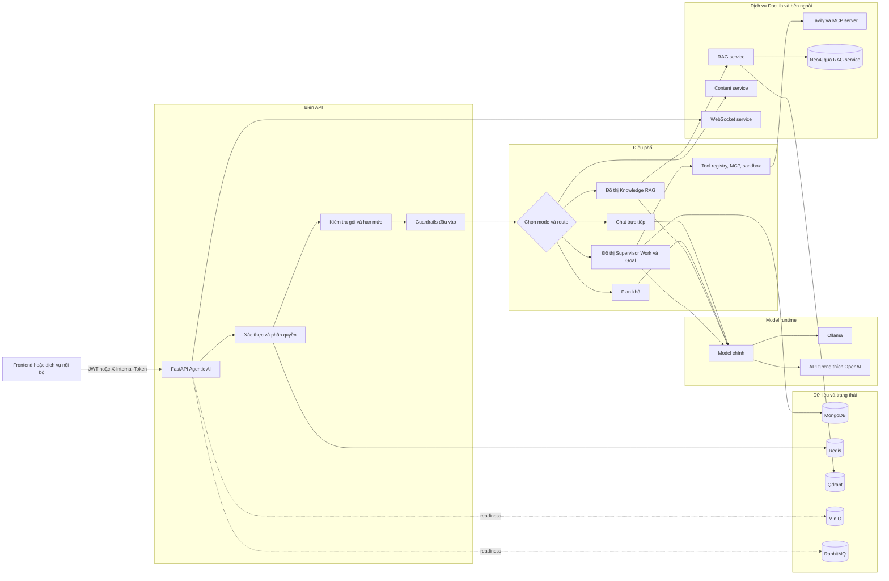
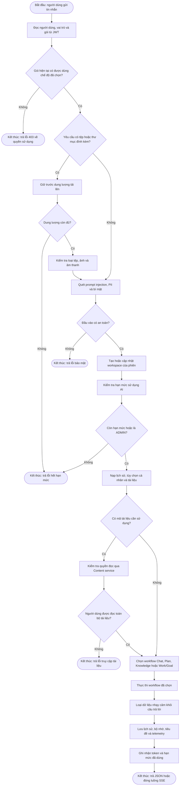
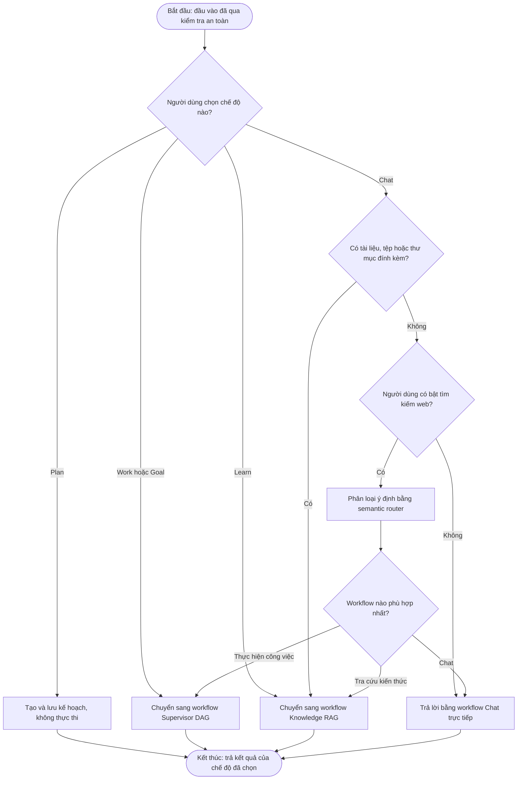
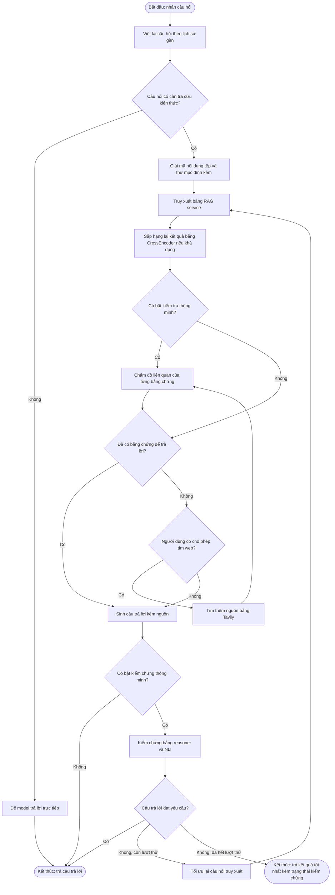
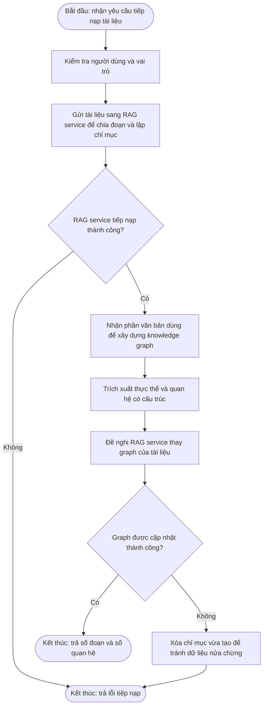
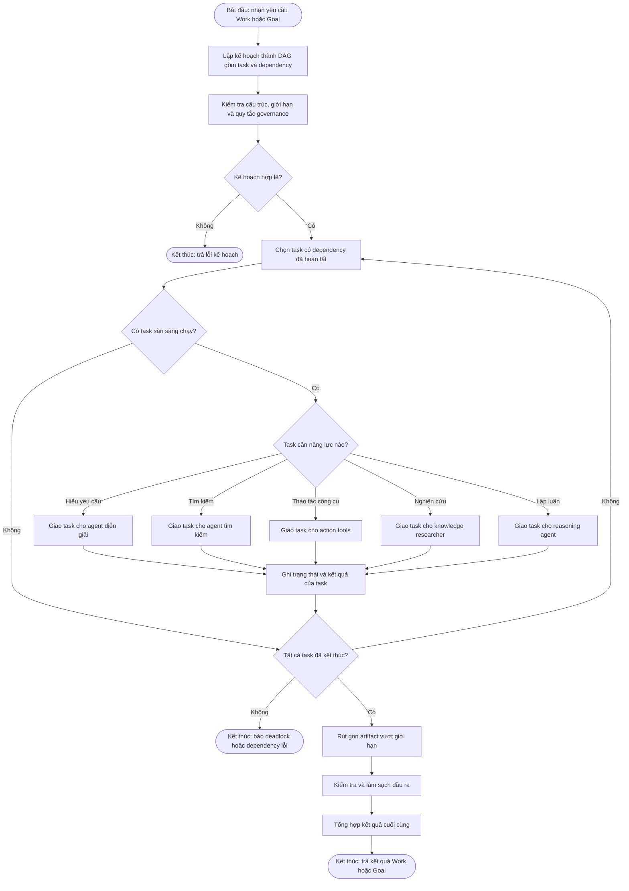
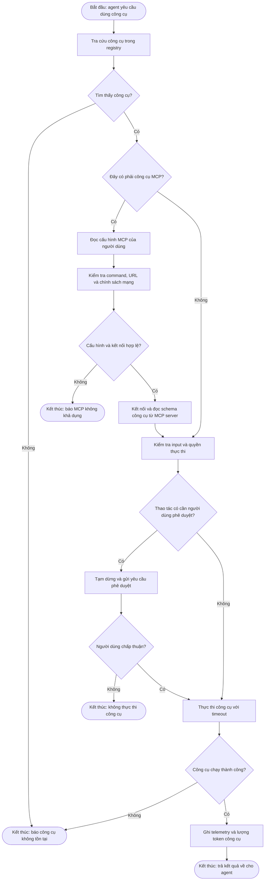
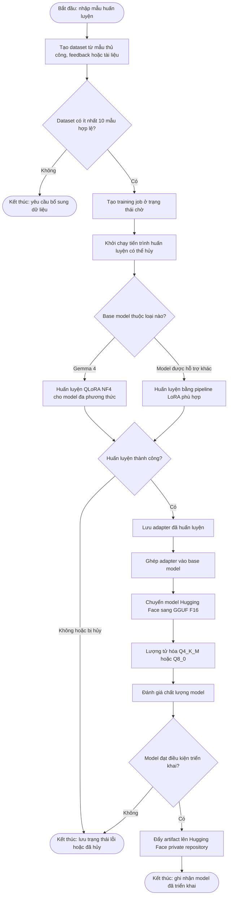
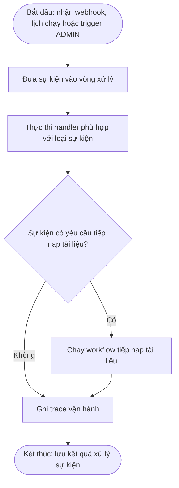
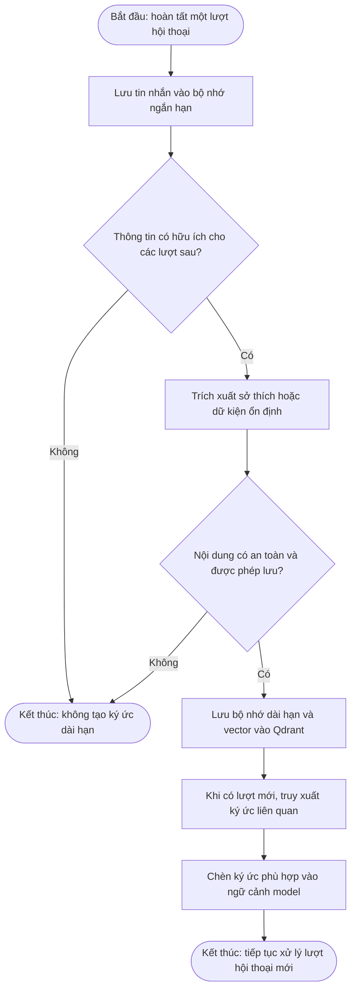

# Agentic AI — kiến trúc và workflow hiện hành

## 1. Kiến trúc tổng thể

## 2. Workflow chung của một lượt hội thoại

## 3. Quy tắc chọn mode và route

## 4. Workflow Knowledge RAG

## 5. Workflow tiếp nạp tri thức

## 6. Workflow Work và Goal: Supervisor DAG

## 7. Workflow công cụ và MCP

## 8. Workflow tinh chỉnh DocLib Metis

## 9. Sự kiện và bộ nhớ

### 9.1 Xử lý sự kiện

### 9.2 Ghi nhớ sau hội thoại

## 10. Nhóm API công khai

| Nhóm        | Prefix                                                 | Trách nhiệm                                                                                |
| ------------ | ------------------------------------------------------ | -------------------------------------------------------------------------------------------- |
| Hội thoại  | `/tro-chuyen`                                        | Chat JSON, SSE, khả năng, workspace và tùy chọn cá nhân                               |
| Lịch sử    | `/lich-su`                                           | Phiên, tiêu đề, trạng thái và tin nhắn                                               |
| Suy luận    | `/suy-luan`                                          | Sinh nội dung, dịch, mã nguồn, tóm tắt, trích xuất, kiểm duyệt và các utility AI |
| Tiếp nạp   | `/tiep-nap`                                          | Thêm/xóa tài liệu khỏi RAG và graph                                                    |
| Phản hồi   | `/phan-hoi`                                          | Ghi nhận đánh giá câu trả lời                                                         |
| Tinh chỉnh  | `/tinh-chinh`                                        | Dataset, sample, job, hủy, đánh giá và triển khai                                      |
| MCP          | `/mcp`                                               | Preset, server, kiểm tra kết nối và callback                                             |
| Sự kiện    | `/su-kien`                                           | Webhook, lịch chạy, lịch sử và trigger                                                  |
| Can thiệp   | `/ngat-qua-trinh`                                    | Hủy phiên và phản hồi yêu cầu phê duyệt                                             |
| Vận hành   | `/health`, `/ready`, `/metrics`, `/evaluate/*` | Liveness, readiness và telemetry                                                            |

## 11. Công nghệ đang sử dụng

| Lớp                  | Công nghệ                                                         | Vai trò thực tế                                                    |
| --------------------- | ------------------------------------------------------------------- | --------------------------------------------------------------------- |
| API                   | Python 3.11, FastAPI, Uvicorn, Pydantic                             | HTTP API, dependency injection, schema và validation                 |
| Streaming             | Server-Sent Events                                                  | Phát model, plan, tool, token và kết quả hội thoại              |
| Agent                 | LangChain, LangGraph                                                | Prompt/model adapter, state graph, checkpoint và DAG orchestration   |
| Model runtime         | Ollama hoặc API tương thích OpenAI                              | Chạy model chính được cấu hình bởi`LLM_MODEL`               |
| Model/NLP             | Transformers, Sentence Transformers, CrossEncoder, NLI, NLLB        | Đa phương thức, rerank, kiểm chứng và dịch                    |
| RAG                   | RAG service, Qdrant, BM25, Neo4j gián tiếp                        | Vector search, hybrid memory và knowledge graph                      |
| Dữ liệu             | MongoDB/Motor/PyMongo, Redis                                        | Lịch sử, checkpoint, cấu hình, cache, memory và session          |
| Hàng đợi/lưu trữ | RabbitMQ, MinIO                                                     | Hạ tầng event/task và object storage của hệ thống               |
| Web/công cụ         | Tavily, MCP SDK, Playwright, HTTPX                                  | Tìm web, công cụ ngoài và gọi microservice                      |
| Bảo mật             | Presidio, spaCy, guardrails nội bộ, JWT, RestrictedPython         | PII, injection, secret leak, auth và sandbox tài nguyên giới hạn |
| Tài liệu            | Docling, MarkItDown, PyMuPDF, pypdfium2, Pillow                     | Trích xuất và xử lý tài liệu/ảnh                              |
| Fine-tuning           | PEFT, TRL, Datasets, Accelerate, bitsandbytes, MLX, llama.cpp, GGUF | LoRA/QLoRA, merge và xuất local model                               |
| Quan sát             | Loguru, Prometheus metrics, AgentOps nội bộ                       | Trace ID, latency, token, tool call và security event                |
| Triển khai           | Docker Compose, Traefik                                             | Container, dependency health và định tuyến service                |
