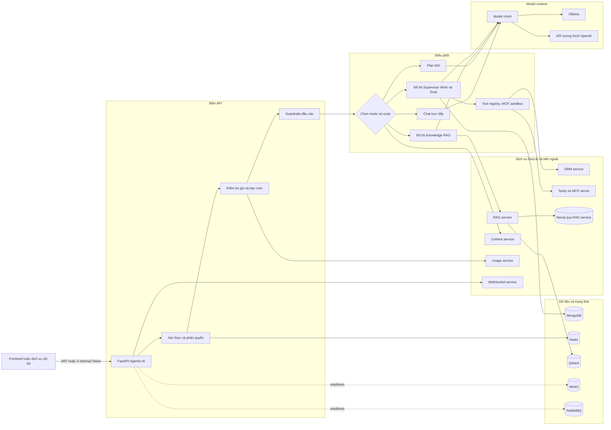
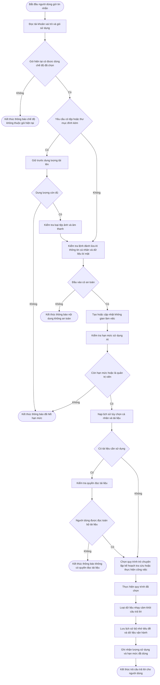
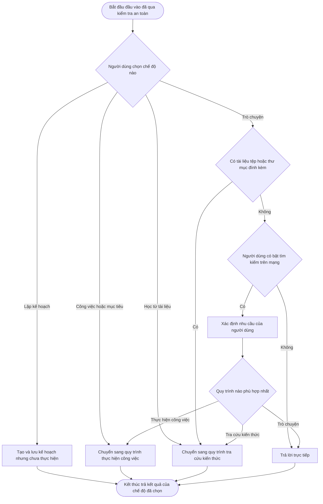
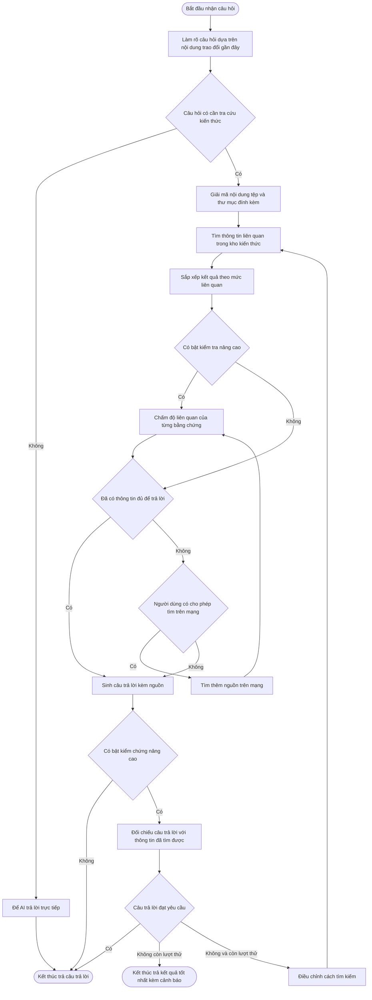
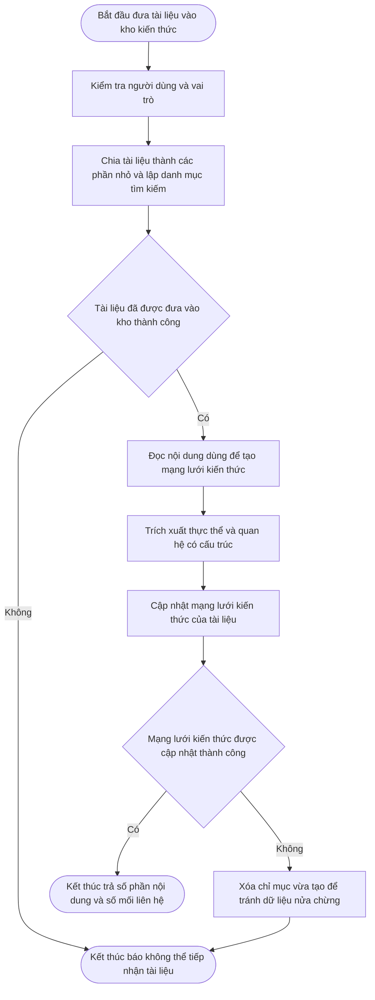
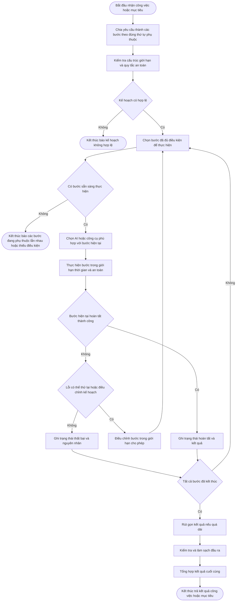
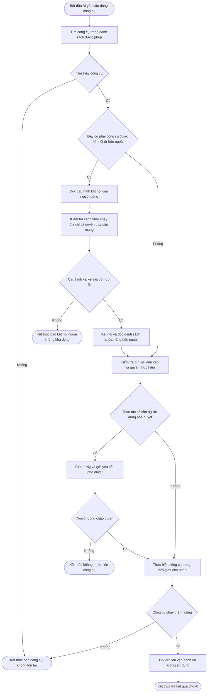
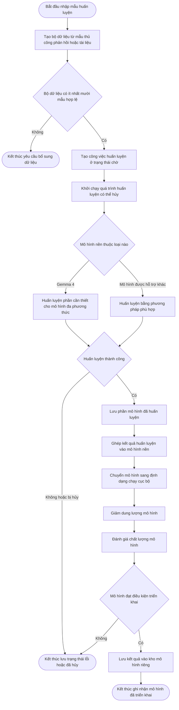
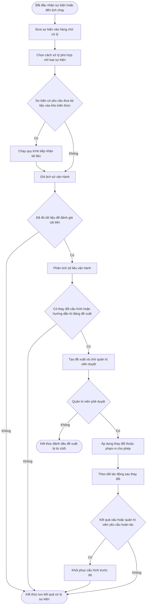
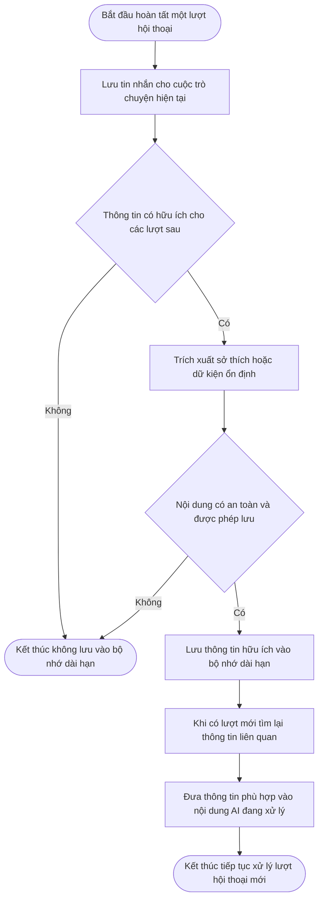

# Agentic AI — kiến trúc và workflow hiện hành

> Nguồn sự thật của tài liệu này là mã nguồn trong `backend/agentic_ai`, cấu hình
> `docker-compose.yml` và các API nội bộ đang được gọi. Tài liệu mô tả thành phần
> đã triển khai; không xem một container hạ tầng tồn tại trong Compose là bằng
> chứng rằng Agentic AI trực tiếp sử dụng container đó.

## 1. Phạm vi dịch vụ

Agentic AI là lớp điều phối AI của DocLib. Dịch vụ chịu trách nhiệm:

- hội thoại đồng bộ và phát trực tiếp bằng SSE;
- phân luồng Chat, Plan, Learn, Work và Goal;
- RAG, tìm kiếm web, đọc tệp và xử lý đa phương thức;
- lập kế hoạch và thực thi DAG đa agent;
- công cụ nội bộ, MCP, sandbox và cơ chế phê duyệt;
- lịch sử, bộ nhớ người dùng và workspace của phiên;
- giới hạn gói, thống kê token, bảo vệ đầu vào/đầu ra;
- sự kiện chủ động, quan sát vận hành và vòng cải tiến có phê duyệt;
- tạo dữ liệu, QLoRA/LoRA, đánh giá và triển khai model tinh chỉnh;
- đánh giá chính sách DRM rủi ro cao cho dịch vụ DRM.

Điểm vào chính: [`backend/agentic_ai/src/main.py`](backend/agentic_ai/src/main.py).

## 2. Kiến trúc tổng thể

Sơ đồ này chỉ mô tả thành phần và quan hệ phụ thuộc, **không phải workflow nghiệp
vụ**. Vì vậy node dùng tên module/dịch vụ; các phần từ mục 3 trở đi mới dùng
quy ước bước xử lý và nút quyết định.

### Ranh giới quan trọng

- Agentic AI gọi RAG service để tiếp nạp, truy xuất và cập nhật graph; việc ghi
  Qdrant/Neo4j nằm sau ranh giới RAG service.
- `PRIMARY_MODEL_STYLE` quyết định runtime model là Ollama hoặc API tương thích
  OpenAI. Không có fallback model âm thầm: model đã cấu hình lỗi thì request lỗi.
- MinIO và RabbitMQ là dependency readiness/runtime; không nên vẽ chúng như một
  bước bắt buộc trong mọi cuộc trò chuyện.
- DRM service gọi ngược Agentic AI ở nhánh đánh giá policy; Agentic AI cũng có
  tool gọi các API bảo vệ nội bộ của DRM.
- Định dạng tài liệu được giữ xuyên suốt: `doclib` là EditorJS JSON, `doclibx` là
  LaTeX. Khi DRM mã hóa, file xuất vẫn lần lượt mang đuôi `.doclib` hoặc
  `.doclibx`; Agentic AI không tự đổi loại tài liệu.

## 3. Workflow chung của một lượt hội thoại

Hai endpoint `/tro-chuyen` và `/tro-chuyen/phat-truc-tiep` dùng cùng logic nghiệp
vụ; endpoint thứ hai phát sự kiện SSE (`start`, `model`, `plan`, `message`,
`tool`, `error`, `done`).

## 4. Quy tắc chọn mode và route

- BASIC được dùng Chat và model chính nhưng không có audio; mode nâng cao hoặc
  `thinking` yêu cầu PRO/PREMIUM, ngoại trừ ADMIN.
- ADMIN dùng cùng khả năng với PREMIUM nhưng bỏ qua việc trừ hạn mức AI.
- `Plan` chỉ sinh và lưu kế hoạch. `Work`/`Goal` mới thực thi kế hoạch.

## 5. Workflow Knowledge RAG

Đây là topology thật trong
[`workflow/graph.py`](backend/agentic_ai/src/workflow/graph.py), không phải một
pipeline nạp dữ liệu.

## 6. Workflow tiếp nạp tri thức

Xóa tài liệu bằng `DELETE /tiep-nap/tai-lieu/{document_id}` cũng được ủy quyền
cho RAG service. Agentic AI không trực tiếp đọc MinIO hoặc ghi Qdrant/Neo4j trong
endpoint này.

## 7. Workflow Work và Goal: Supervisor DAG

Việc chọn bộ thực thi ở bước “Chọn agent hoặc công cụ” tuân theo bảng sau; đây
là ánh xạ thành phần, không phải các bước chạy nối tiếp nhau:

| Nhu cầu của task | Bộ thực thi |
|---|---|
| Diễn giải yêu cầu | Interpreter agent |
| Tìm kiếm | Engine agent |
| Thao tác hệ thống | Action tools |
| Nghiên cứu tri thức | Knowledge researcher |
| Lập luận | Reasoning agent hoặc MCTS |
| Mã nguồn, review, bảo mật | Coder, Reviewer hoặc SecOps |
| Chuyên môn động | Domain specialist |

Các chốt an toàn gồm timeout toàn phiên, giới hạn replan, phát hiện deadlock,
phát hiện lặp task, recursion limit, governance theo tool và cơ chế ngắt/phê
duyệt từ người dùng.

## 8. Workflow công cụ và MCP

MCP preset chỉ được hiển thị/kết nối sau khi server vượt qua kiểm tra cấu hình và
khả năng kết nối. Hai preset tích hợp sẵn là Reqwise Figma và Chrome DevTools.
Khi người dùng kết nối lại một preset đã tồn tại, backend luôn probe lại và thay
cấu hình cũ bằng command/args bất biến hiện hành trước khi đánh dấu kết nối.
Cấu hình được lưu theo người dùng trong MongoDB.

## 9. Workflow tinh chỉnh DocLib Metis

Pipeline Gemma 4 dùng chung mã nguồn giữa dự án và notebook Colab tại
[`training/gemma4_finetuning.py`](backend/agentic_ai/src/training/gemma4_finetuning.py).

## 10. Sự kiện, bộ nhớ và vòng cải tiến

### 10.1 Xử lý sự kiện và đề xuất cải tiến

Vòng cải tiến không tự ý sửa mã nguồn. Các đề xuất nằm trong nhóm cấu hình/prompt
được hỗ trợ và phải đi qua API phê duyệt của ADMIN.

### 10.2 Ghi nhớ sau hội thoại

## 11. Nhóm API công khai

| Nhóm | Prefix | Trách nhiệm |
|---|---|---|
| Hội thoại | `/tro-chuyen` | Chat JSON, SSE, khả năng, workspace và tùy chọn cá nhân |
| Lịch sử | `/lich-su` | Phiên, tiêu đề, trạng thái và tin nhắn |
| Suy luận | `/suy-luan` | Sinh nội dung, dịch, mã nguồn, tóm tắt, trích xuất, kiểm duyệt và các utility AI |
| Tiếp nạp | `/tiep-nap` | Thêm/xóa tài liệu khỏi RAG và graph |
| Phản hồi | `/phan-hoi` | Ghi nhận đánh giá câu trả lời |
| Tinh chỉnh | `/tinh-chinh` | Dataset, sample, job, hủy, đánh giá và triển khai |
| MCP | `/mcp` | Preset, server, kiểm tra kết nối và callback |
| Sự kiện | `/su-kien` | Webhook, lịch chạy, lịch sử và trigger |
| Tự tối ưu | `/toi-uu` | Vấn đề, đề xuất, phê duyệt và hoàn tác |
| Can thiệp | `/ngat-qua-trinh` | Hủy phiên và phản hồi yêu cầu phê duyệt |
| DRM nội bộ | `/drm` | Đánh giá policy DRM rủi ro cao |
| Vận hành | `/health`, `/ready`, `/metrics`, `/evaluate/*` | Liveness, readiness và telemetry |

## 12. Công nghệ đang sử dụng

| Lớp | Công nghệ | Vai trò thực tế |
|---|---|---|
| API | Python 3.11, FastAPI, Uvicorn, Pydantic | HTTP API, dependency injection, schema và validation |
| Streaming | Server-Sent Events | Phát model, plan, tool, token và kết quả hội thoại |
| Agent | LangChain, LangGraph | Prompt/model adapter, state graph, checkpoint và DAG orchestration |
| Model runtime | Ollama hoặc API tương thích OpenAI | Chạy model chính được cấu hình bởi `LLM_MODEL` |
| Model/NLP | Transformers, Sentence Transformers, CrossEncoder, NLI, NLLB | Đa phương thức, rerank, kiểm chứng và dịch |
| RAG | RAG service, Qdrant, BM25, Neo4j gián tiếp | Vector search, hybrid memory và knowledge graph |
| Dữ liệu | MongoDB/Motor/PyMongo, Redis | Lịch sử, checkpoint, cấu hình, cache, memory và session |
| Hàng đợi/lưu trữ | RabbitMQ, MinIO | Hạ tầng event/task và object storage của hệ thống |
| Web/công cụ | Tavily, MCP SDK, Playwright, HTTPX | Tìm web, công cụ ngoài và gọi microservice |
| Bảo mật | Presidio, spaCy, guardrails nội bộ, JWT, RestrictedPython | PII, injection, secret leak, auth và sandbox tài nguyên giới hạn |
| Tài liệu | Docling, MarkItDown, PyMuPDF, pypdfium2, Pillow | Trích xuất và xử lý tài liệu/ảnh |
| Fine-tuning | PEFT, TRL, Datasets, Accelerate, bitsandbytes, MLX, llama.cpp, GGUF | LoRA/QLoRA, merge và xuất local model |
| Quan sát | Loguru, Prometheus metrics, AgentOps nội bộ | Trace ID, latency, token, tool call và security event |
| Triển khai | Docker Compose, Traefik | Container, dependency health và định tuyến service |

## 13. Nguồn kiểm chứng chính

- [Khởi tạo service và readiness](backend/agentic_ai/src/main.py)
- [Hội thoại đồng bộ](backend/agentic_ai/src/api/interaction/executor.py)
- [Hội thoại SSE](backend/agentic_ai/src/api/interaction/stream.py)
- [Knowledge graph workflow](backend/agentic_ai/src/workflow/graph.py)
- [Supervisor DAG workflow](backend/agentic_ai/src/workflow/orchestration.py)
- [RAG client](backend/agentic_ai/src/services/rag_client.py)
- [MCP service](backend/agentic_ai/src/services/mcp.py)
- [Fine-tuning service](backend/agentic_ai/src/services/finetuning.py)
- [Danh sách dependency](backend/agentic_ai/requirements.txt)

## 14. Quy tắc cập nhật tài liệu

Khi thêm route, node LangGraph, service dependency hoặc backend công nghệ mới,
cần cập nhật đồng thời bảng API, sơ đồ liên quan và bảng công nghệ. Không dùng
URI file tuyệt đối; mọi liên kết phải tương đối từ root repository.
