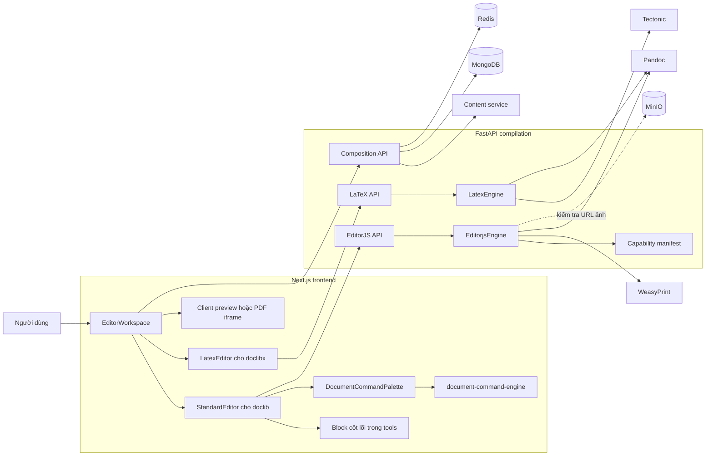
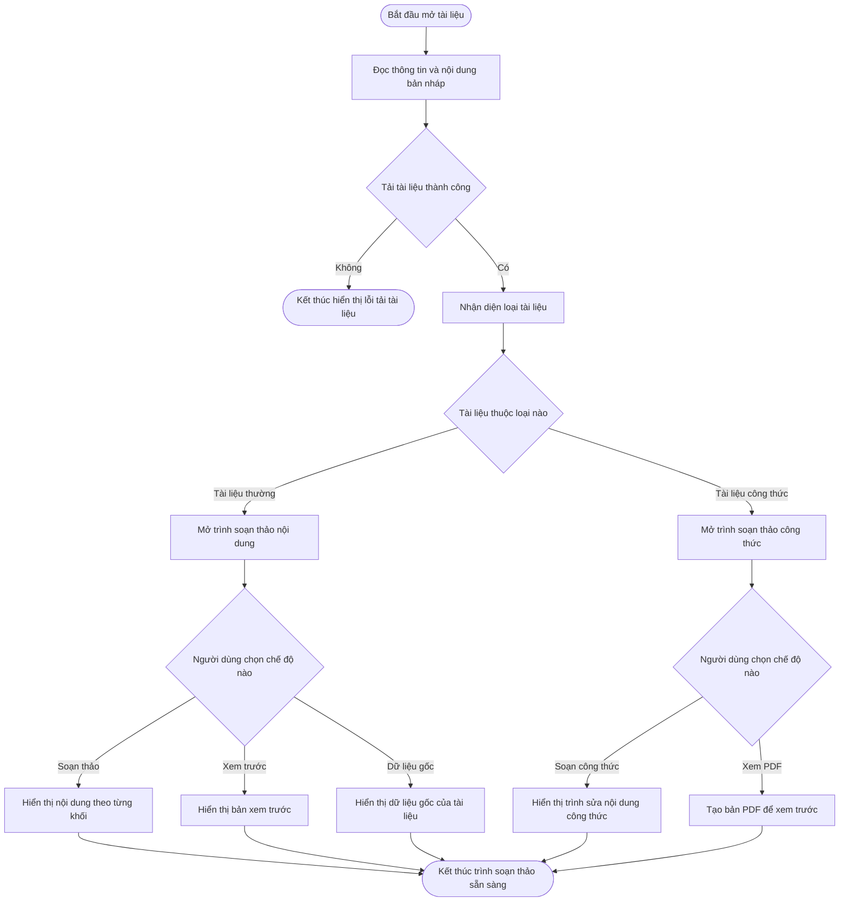
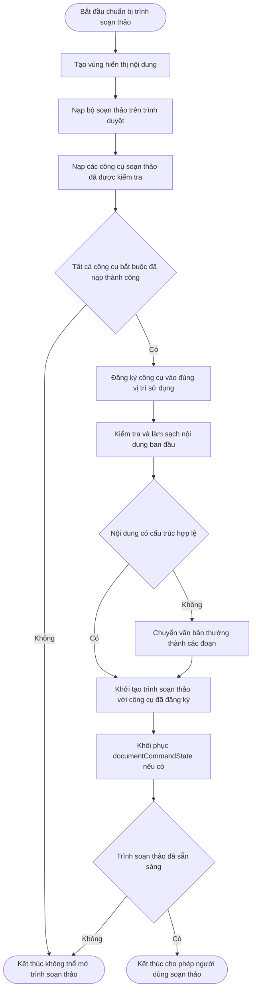
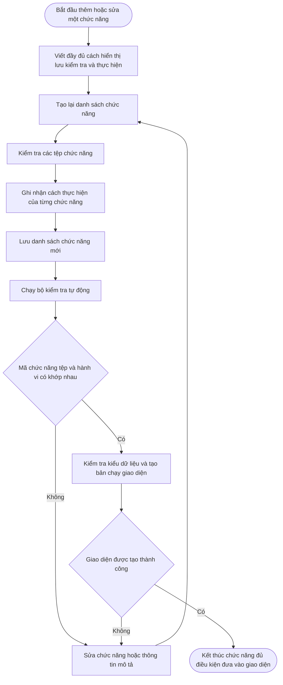
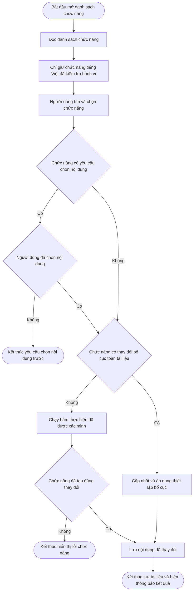
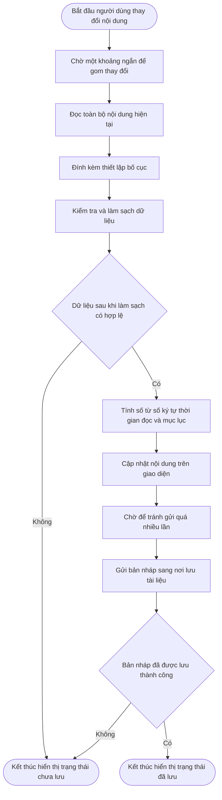
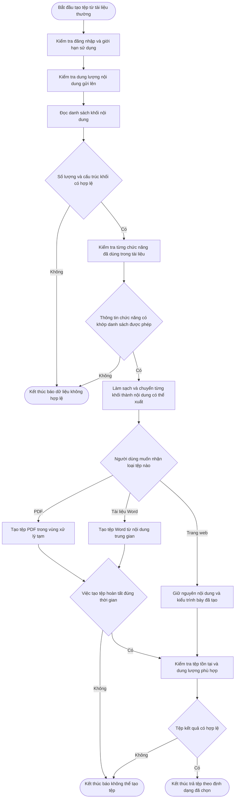
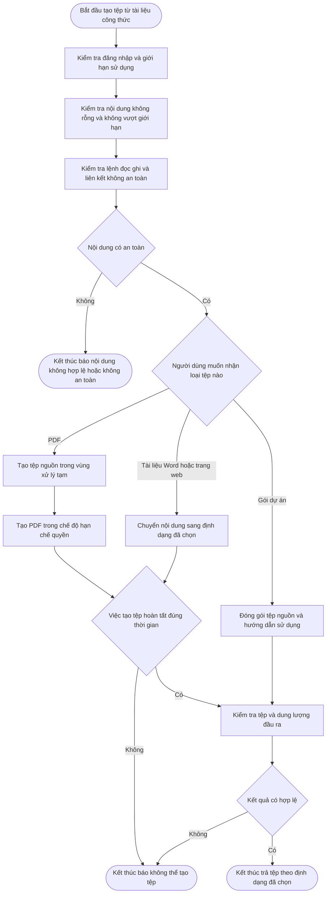
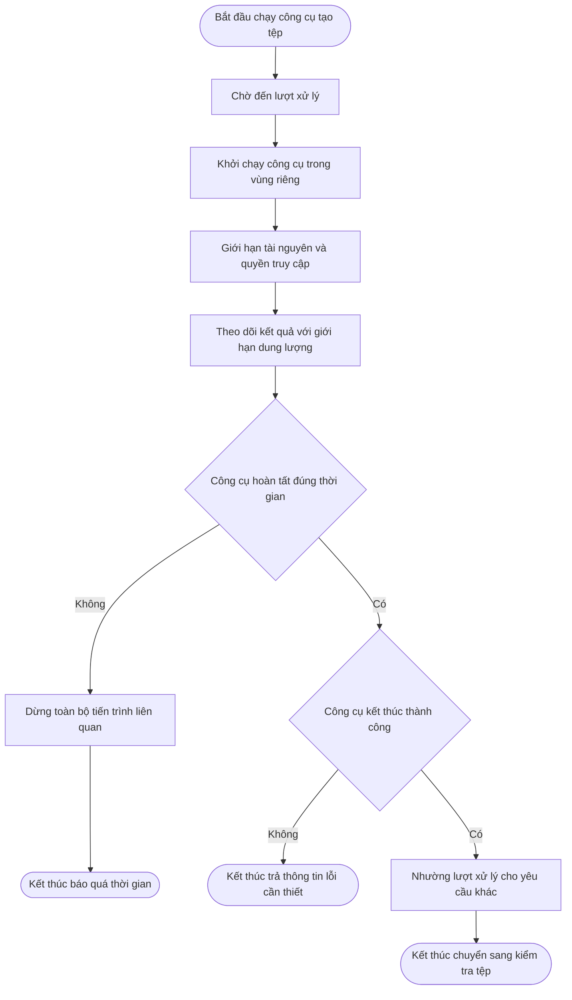
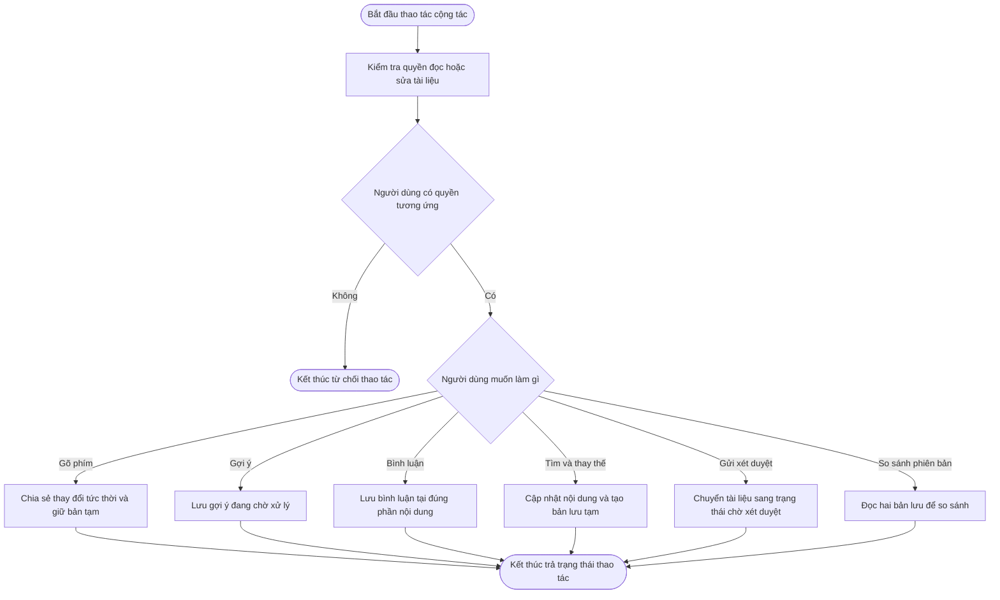

# Compilation — kiến trúc, workflow và EditorJS tùy biến

## 1. Kiến trúc tổng thể

### Ranh giới dữ liệu

| Thành phần             | Dữ liệu chịu trách nhiệm                                                          |
| ------------------------ | -------------------------------------------------------------------------------------- |
| Content service          | Tài liệu, nội dung nháp, trạng thái xuất bản và version snapshot              |
| MongoDB của compilation | Gợi ý chỉnh sửa, bình luận và phiên Pomodoro                                   |
| Redis                    | Session, rate limit, LaTeX draft, keystroke snapshot và pub/sub                       |
| MinIO                    | Nguồn ảnh được phép khi EditorJS render; compilation không tự quản lý object |
| Thư mục tạm           | `main.tex`, HTML trung gian và tệp kết xuất; xóa khi request kết thúc         |

## 3. Workflow chọn trình soạn thảo ở frontend

Frontend chuẩn hóa định dạng cũ `json → doclib` và `latex → doclibx` trước khi
chọn giao diện.

`.doclib` là EditorJS JSON; `.doclibx` là LaTeX source. Hai loại tài liệu dùng
chung workspace nhưng không dùng chung editor hoặc định dạng nội dung.

## 4. Workflow nạp block DocLib cốt lõi vào EditorJS

`StandardEditor.tsx` hiện dynamic-import 31 module cốt lõi đã có hành vi, sau đó đăng ký chúng
trong `tools` của EditorJS. Đây mới là nhóm block/tune thực sự được nạp khi editor
khởi tạo; không phải toàn bộ 2.449 file `DocLib*`.

Nhóm cốt lõi gồm paragraph, header, list, checklist, table, quote, code, raw,
delimiter, image, file, alert, toggle, math, Mermaid, embed, các inline tool,
alignment/indent, shape, video, audio, AI text, form, macro, label và citation.

## 5. Workflow tạo và đưa command DocLib vào frontend

### 5.1 Hai lớp mở rộng khác nhau

| Lớp                 | Cách tích hợp                                                     | Trạng thái runtime hiện tại                                                 |
| -------------------- | -------------------------------------------------------------------- | ------------------------------------------------------------------------------- |
| Block/tune cốt lõi | Import và khai báo trực tiếp trong`StandardEditor.tools`       | 31 module được nạp khi mở editor; MacroButton giả lập không được đăng ký    |
| Chức năng tài liệu   | Danh sách sinh tự động và bộ thực thi đã xác minh                  | 2.296 chức năng trong danh sách và 55 chức năng đã được hiển thị           |
| Capability manifest  | Metadata đồng bộ frontend/backend                                 | 2.449 feature; backend dùng để tra cứu và xác minh command block          |

Không nên gọi cả 2.449 feature là “EditorJS tools đang được nạp”. Phần lớn là
khả năng/command độc lập; chỉ module nằm trong `tools` mới là tool khởi tạo cùng
EditorJS.

### 5.2 Quy trình build catalog command

`prebuild` hiện chạy audit nhưng **không tự generate catalog**. Vì vậy sau khi
thêm command phải chạy generate trước; nếu chỉ chạy build, catalog cũ vẫn có thể
được audit mà chưa chứa command mới.

Script [`rebuild_word_feature_catalog.py`](scripts/rebuild_word_feature_catalog.py)
là đường tạo hàng loạt từ spreadsheet: sinh file class, metadata, icon và hai
manifest frontend/backend. Script này không phải bước tự động trong frontend
build hiện tại.

## 6. Workflow thực thi một command trong EditorJS

`DocumentCommandPalette` chỉ hiển thị command có nhãn tiếng Việt, mang
`implementation: direct` và nằm trong `verifiedInteractiveCommands`. Catalog có
2.296 command, nhưng giao diện hiện chỉ công khai 55 command đã có hành vi thật.
Tám command cấp tài liệu có hiệu ứng bền vững còn phải đồng bộ tuyệt đối với
`VERIFIED_DOCUMENT_COMMANDS` của compilation service trước khi Agentic AI được
phép gọi.

Bridge hiện ánh xạ một số mode sang `document.execCommand`, zoom, line spacing
hoặc page break. Đường ghi `data-document-mode` và thông báo thành công chung đã
bị loại bỏ. Command chưa có handler và chưa vượt audit bị chặn ngay cả khi file
class hoặc record catalog vẫn tồn tại.

## 7. Workflow lưu tài liệu EditorJS

Composition API còn có luồng `/soan-thao/{document_id}/tu-dong-luu` riêng để
kiểm tra tối đa 5.000 block, tạo mục lục/thời gian đọc và cập nhật Content bằng
internal token.

## 8. Workflow biên dịch và kết xuất EditorJS

Command block nằm trong capability manifest được xác minh nhưng không render như
nội dung tài liệu. Các block nội dung không nhận diện hoặc không hợp lệ bị bỏ qua
và ghi warning thay vì thực thi mã tùy ý.

## 9. Workflow biên dịch và kết xuất LaTeX

Tectonic dùng cache volume riêng. Compilation không chạy `shell-escape`, không
cho LaTeX đọc file tùy ý và không cho tải tài nguyên qua URL từ source.

## 10. Workflow giới hạn tiến trình biên dịch

EditorJS và LaTeX dùng chung semaphore và hàm chạy subprocess.

## 11. Workflow cộng tác và xét duyệt

## 12. API hiện hành

| Nhóm       | Endpoint chính                                               | Chức năng                                                       |
| ----------- | ------------------------------------------------------------- | ----------------------------------------------------------------- |
| EditorJS    | `/soan-thao/editorjs/bien-dich`                             | EditorJS → PDF                                                   |
| EditorJS    | `/soan-thao/editorjs/ket-xuat/{format}`                     | EditorJS → PDF, DOCX hoặc HTML                                  |
| Capability  | `/soan-thao/editorjs/capabilities`                          | Tìm và phân trang feature manifest                             |
| LaTeX       | `/soan-thao/latex/bien-dich`                                | LaTeX → PDF                                                      |
| LaTeX       | `/soan-thao/latex/ket-xuat/{format}`                        | LaTeX → PDF, DOCX hoặc HTML                                     |
| LaTeX       | `/soan-thao/latex/dinh-dang`                                | Chuẩn hóa thụt dòng LaTeX                                     |
| LaTeX       | `/soan-thao/latex/ket-xuat-zip`                             | Tạo project ZIP                                                  |
| LaTeX draft | `/soan-thao/latex/tu-dong-luu`, `/ban-nhap`, `/don-dep` | Lưu, đọc và xóa draft trong Redis                            |
| Composition | `/soan-thao/{document_id}/*`                                | Autosave, keystroke, review, comment, suggestion và version diff |
| Vận hành  | `/health`, `/ready`, `/metrics`                         | Liveness, Mongo/Redis readiness và metrics                       |

## 13. Công nghệ đang sử dụng

| Lớp               | Công nghệ                                                       | Vai trò thực tế                                                   |
| ------------------ | ----------------------------------------------------------------- | -------------------------------------------------------------------- |
| Frontend           | Next.js, React, TypeScript                                        | Workspace, trạng thái editor, lazy loading và tải tệp           |
| Trình soạn thảo | Editor.js, DocLib BlockTool/InlineTool/BlockTune                  | Soạn`.doclib` theo block                                          |
| Command runtime    | Dynamic import, CustomEvent, DOM Selection,`execCommand` bridge | Nạp và thực thi command tài liệu                                |
| Catalog            | JSON manifest, Node.js generator, Python bulk generator           | Đồng bộ feature và command metadata                              |
| API                | Python 3.11, FastAPI, Uvicorn, Pydantic                           | HTTP API, schema và dependency injection                            |
| EditorJS render    | Bleach, HTML/CSS, WeasyPrint                                      | Sanitize block và tạo PDF                                          |
| Chuyển đổi      | Pandoc                                                            | EditorJS/LaTeX sang DOCX hoặc HTML                                  |
| LaTeX              | Tectonic 0.15 ở chế độ untrusted                              | Biên dịch`.doclibx` thành PDF                                   |
| Dữ liệu          | MongoDB, Motor, Redis                                             | Comment, suggestion, Pomodoro, draft, rate limit và realtime buffer |
| Giao tiếp         | HTTPX                                                             | Đọc quyền/nội dung và cập nhật Content service                |
| Bảo mật          | PyJWT, Bleach, URL allowlist, RLIMIT, timeout, semaphore          | Xác thực và cô lập tiến trình biên dịch                     |
| Quan sát          | Loguru, Prometheus middleware, trace ID                           | Log, metrics và correlation                                         |
| Triển khai        | Docker Compose, Traefik, non-root container                       | Route`/soan-thao`, health check và runtime tools                  |

Ghostscript và các bộ font được cài trong image để hỗ trợ toolchain, nhưng mã
engine hiện không gọi Ghostscript như một bước trực tiếp.

## 14. Trạng thái và giới hạn cần hiểu đúng

- Có 2.449 file feature không có nghĩa 2.449 tính năng đều đang hiện cho người dùng.
- `StandardEditor` chỉ đăng ký nhóm block cốt lõi trong `tools`.
- Tệp `document-command-catalog.generated.json` có 2.296 mục gồm 347 mục direct và 1.949 mục bridge
- Nhãn direct và bridge chỉ mô tả nguồn danh mục chứ không phải bằng chứng chức năng đã chạy được
- Giao diện chỉ cho thực hiện các chức năng nằm trong danh sách xác minh và không còn nạp động ghost class
- Palette hiện công khai 55 command đã vượt kiểm thử hành vi; Agentic AI được
  gọi 12 command bền vững, 6 command cấu trúc, 12 command định dạng văn bản,
  2 command theo khối và 4 command phân tích có
  registry chung với compilation service, cùng 2 command block dành cho bảng
  và hình ảnh, cùng 4 command phân tích không làm thay đổi nội dung.
- `generate:document-commands` không tự chạy trong `prebuild`; phải chạy chủ động
  khi thêm/xóa command.
- Manifest frontend và backend hiện cùng 2.449 feature và phải giống nhau tuyệt đối.
- Backend bỏ command block khỏi luồng văn bản nhưng xác minh
  `documentCommandState` và áp hiệu ứng bền vững như số cột, hình mờ và tỷ lệ
  khi kết xuất.
- Frontend phải giữ `.doclibx` khi tải container DRM của tài liệu LaTeX; không
  được đổi mọi protected export thành `.doclib`.

## 15. Nguồn kiểm chứng chính

- [Khởi tạo compilation service](backend/compilation/src/main.py)
- [EditorJS API](backend/compilation/src/api/editorjs.py)
- [LaTeX API](backend/compilation/src/api/latex.py)
- [EditorJS engine](backend/compilation/src/engines/editorjs.py)
- [LaTeX engine](backend/compilation/src/engines/latex.py)
- [Capability validation](backend/compilation/src/engines/editorjs_capabilities.py)
- [Frontend workspace](frontend/features/compilation/components/EditorWorkspace.tsx)
- [StandardEditor](frontend/features/compilation/components/StandardEditor.tsx)
- [Command palette](frontend/features/compilation/components/DocumentCommandPalette.tsx)
- [Command runtime](frontend/features/compilation/components/document-command-engine.ts)
- [Catalog generator](frontend/scripts/generate-document-command-catalog.mjs)
- [Compilation component audit](scripts/audit_compilation_components.py)

## 16. Quy tắc cập nhật tài liệu

Khi thêm engine, định dạng xuất, core block, command, manifest field hoặc API
composition, phải cập nhật workflow liên quan, bảng API, số liệu catalog và bảng
công nghệ. Không mô tả file class tồn tại như một tính năng đã hiển thị nếu nó
chưa được đăng ký trong `tools` hoặc chưa vượt qua bộ lọc của command palette.
