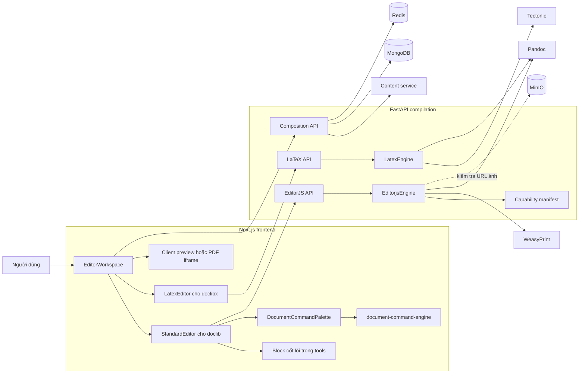
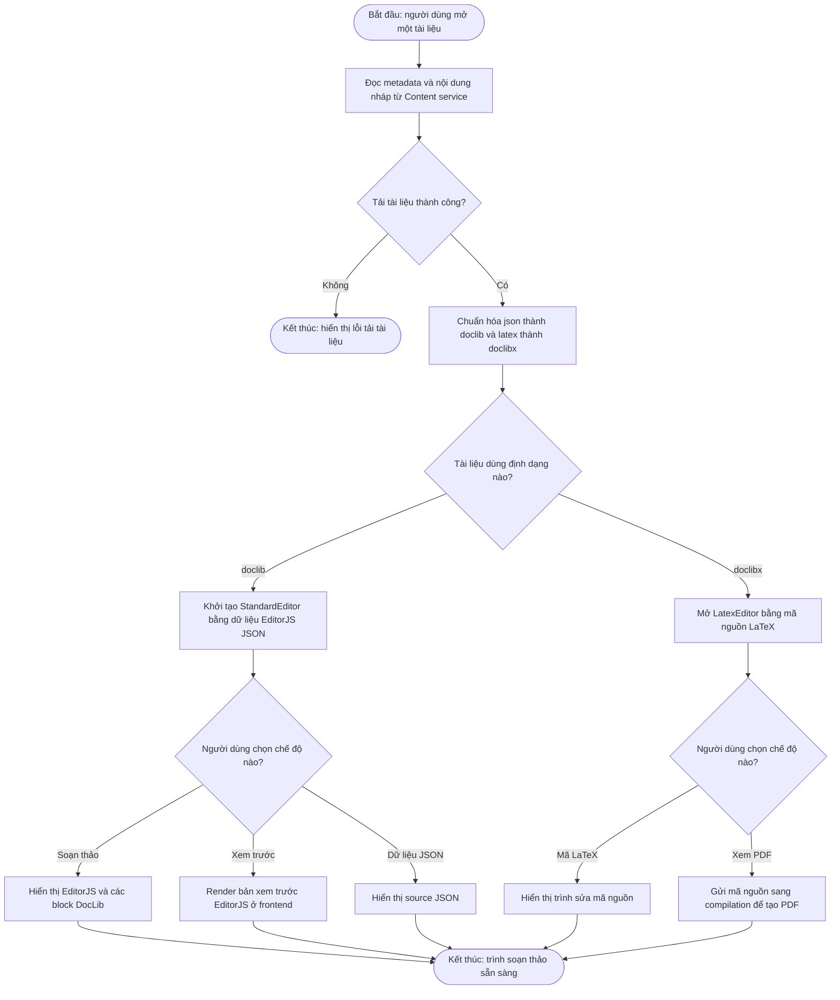
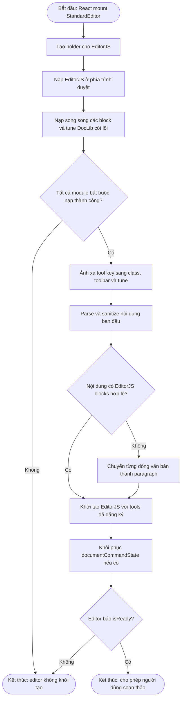
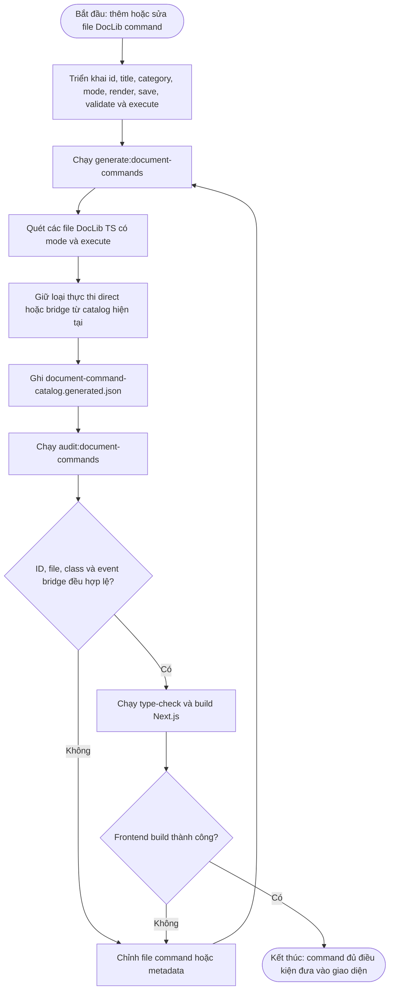
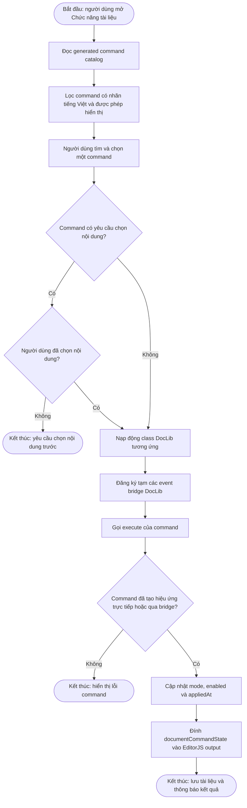
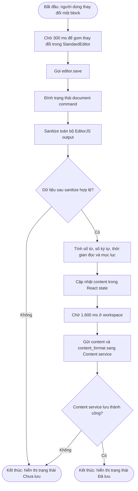
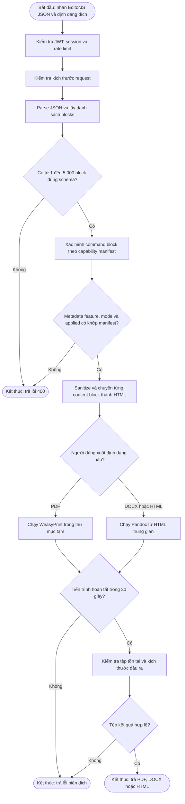
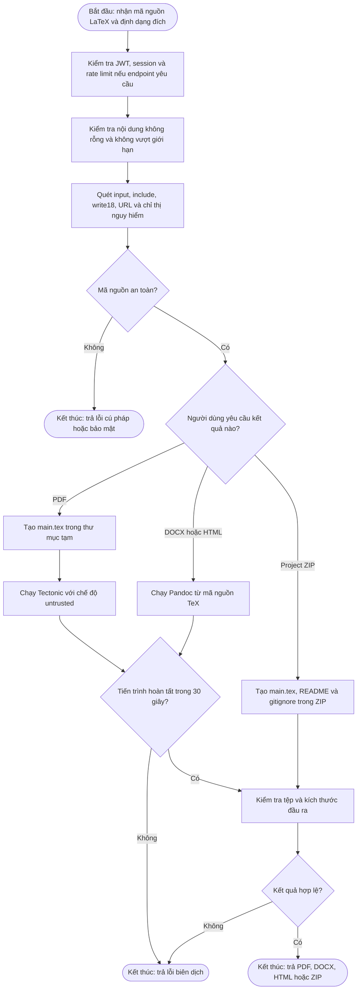
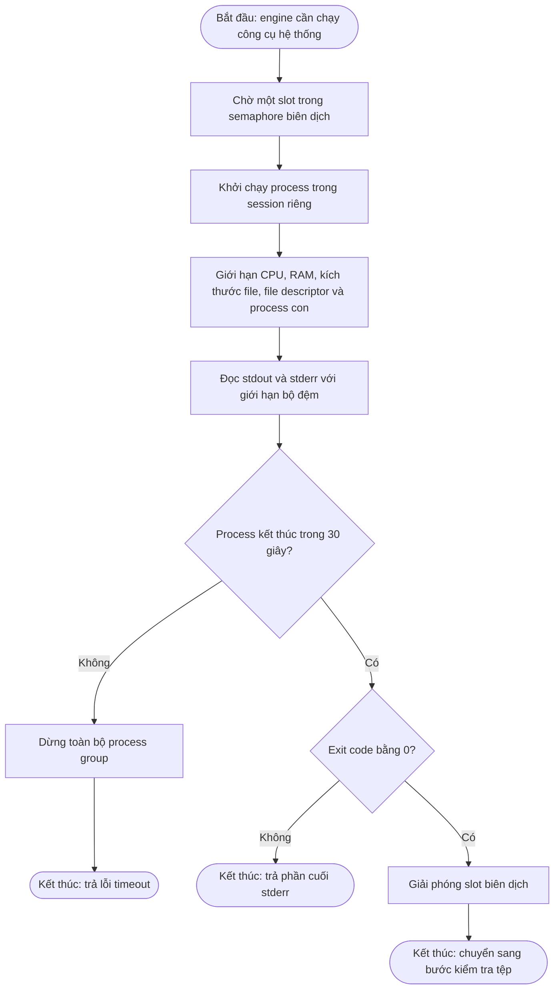
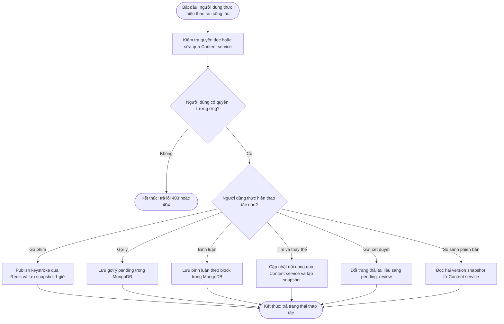

# Compilation — kiến trúc, workflow và EditorJS tùy biến

## 1. Kiến trúc tổng thể

## 2. Workflow chọn trình soạn thảo ở frontend

## 3. Workflow nạp block DocLib cốt lõi vào EditorJS

## 4. Workflow tạo và đưa command DocLib vào frontend

### 4.1 Hai lớp mở rộng khác nhau

| Lớp                 | Cách tích hợp                                                     | Trạng thái runtime hiện tại                                                 |
| -------------------- | -------------------------------------------------------------------- | ------------------------------------------------------------------------------- |
| Block/tune cốt lõi | Import và khai báo trực tiếp trong`StandardEditor.tools`       | 32 module được nạp khi mở editor                                           |
| Document command     | File`DocLib*.ts` + generated JSON + command palette + event bridge | 2.296 command trong catalog; 26 command đã được hiển thị có chủ đích |
| Capability manifest  | Metadata đồng bộ frontend/backend                                 | 2.449 feature; backend dùng để tra cứu và xác minh command block          |

Không nên gọi cả 2.449 feature là “EditorJS tools đang được nạp”. Phần lớn là
khả năng/command độc lập; chỉ module nằm trong `tools` mới là tool khởi tạo cùng
EditorJS.

### 4.2 Quy trình build catalog command

## 5. Workflow thực thi một command trong EditorJS

## 6. Workflow lưu tài liệu EditorJS

## 7. Workflow biên dịch và kết xuất EditorJS

## 8. Workflow biên dịch và kết xuất LaTeX

Tectonic dùng cache volume riêng. Compilation không chạy `shell-escape`, không
cho LaTeX đọc file tùy ý và không cho tải tài nguyên qua URL từ source.

## 9. Workflow giới hạn tiến trình biên dịch

## 10. Workflow cộng tác và xét duyệt

## 11. API hiện hành

| Nhóm       | Endpoint chính                                               | Chức năng                                                       |
| ----------- | ------------------------------------------------------------- | ----------------------------------------------------------------- |
| EditorJS    | `/soan-thao/editorjs/bien-dich`                             | EditorJS → PDF                                                   |
| EditorJS    | `/soan-thao/editorjs/ket-xuat/{format}`                     | EditorJS → PDF, DOCX hoặc HTML                                  |
| Capability  | `/soan-thao/editorjs/capabilities`                          | Tìm và phân trang feature manifest                             |
| LaTeX       | `/soan-thao/latex/bien-dich`                                | LaTeX → PDF                                                      |
| LaTeX       | `/soan-thao/latex/ket-xuat/{format}`                        | LaTeX → PDF, DOCX hoặc HTML                                     |
| LaTeX       | `/soan-thao/latex/dinh-dang`                                | Chuẩn hóa thụt dòng LaTeX                                     |
| LaTeX       | `/soan-thao/latex/ket-xuat-zip`                             | Tạo project ZIP                                                  |
| LaTeX draft | `/soan-thao/latex/tu-dong-luu`, `/ban-nhap`, `/don-dep` | Lưu, đọc và xóa draft trong Redis                            |
| Composition | `/soan-thao/{document_id}/*`                                | Autosave, keystroke, review, comment, suggestion và version diff |
| Vận hành  | `/health`, `/ready`, `/metrics`                         | Liveness, Mongo/Redis readiness và metrics                       |

## 12. Công nghệ đang sử dụng

| Lớp               | Công nghệ                                                       | Vai trò thực tế                                                   |
| ------------------ | ----------------------------------------------------------------- | -------------------------------------------------------------------- |
| Frontend           | Next.js, React, TypeScript                                        | Workspace, trạng thái editor, lazy loading và tải tệp           |
| Trình soạn thảo | Editor.js, DocLib BlockTool/InlineTool/BlockTune                  | Soạn`.doclib` theo block                                          |
| Command runtime    | Dynamic import, CustomEvent, DOM Selection,`execCommand` bridge | Nạp và thực thi command tài liệu                                |
| Catalog            | JSON manifest, Node.js generator, Python bulk generator           | Đồng bộ feature và command metadata                              |
| API                | Python 3.11, FastAPI, Uvicorn, Pydantic                           | HTTP API, schema và dependency injection                            |
| EditorJS render    | Bleach, HTML/CSS, WeasyPrint                                      | Sanitize block và tạo PDF                                          |
| Chuyển đổi      | Pandoc                                                            | EditorJS/LaTeX sang DOCX hoặc HTML                                  |
| LaTeX              | Tectonic 0.15 ở chế độ untrusted                              | Biên dịch`.doclibx` thành PDF                                   |
| Dữ liệu          | MongoDB, Motor, Redis                                             | Comment, suggestion, Pomodoro, draft, rate limit và realtime buffer |
| Giao tiếp         | HTTPX                                                             | Đọc quyền/nội dung và cập nhật Content service                |
| Bảo mật          | PyJWT, Bleach, URL allowlist, RLIMIT, timeout, semaphore          | Xác thực và cô lập tiến trình biên dịch                     |
| Quan sát          | Loguru, Prometheus middleware, trace ID                           | Log, metrics và correlation                                         |
| Triển khai        | Docker Compose, Traefik, non-root container                       | Route`/soan-thao`, health check và runtime tools                  |
