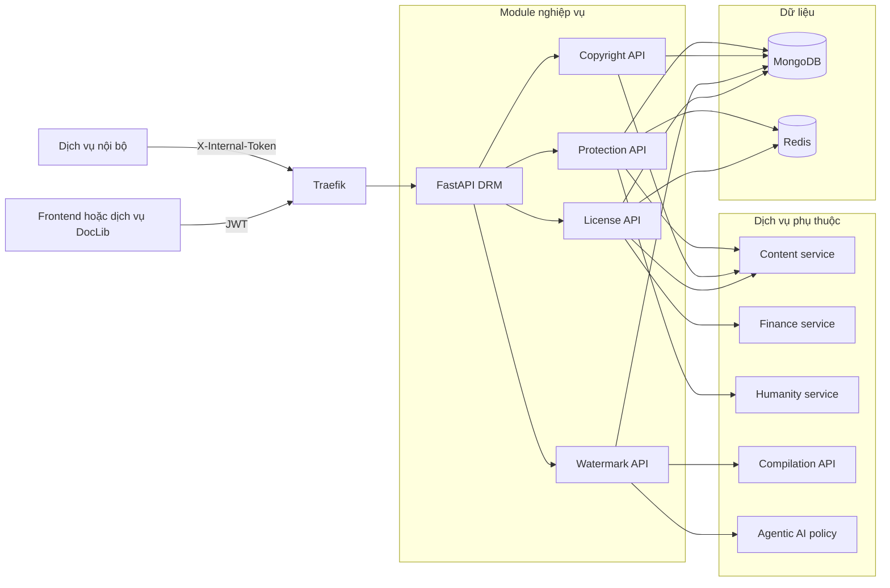
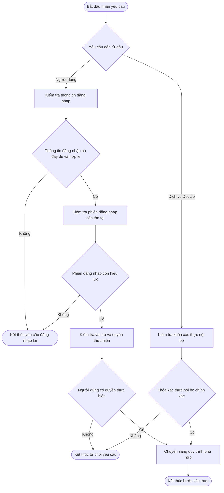
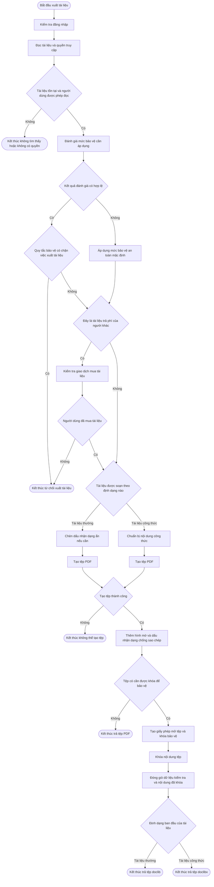
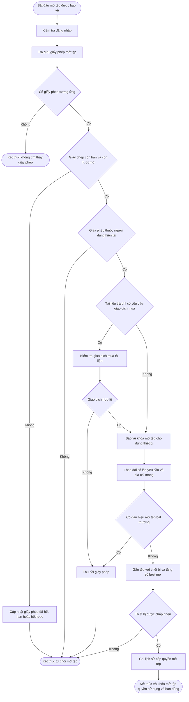
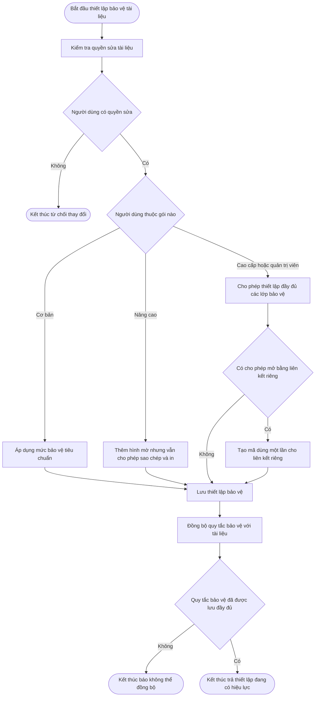
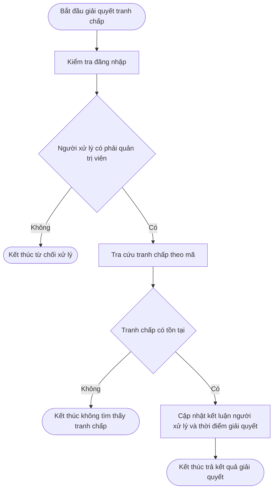
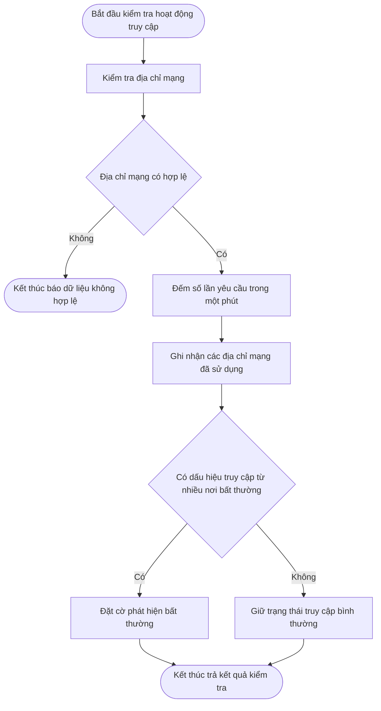
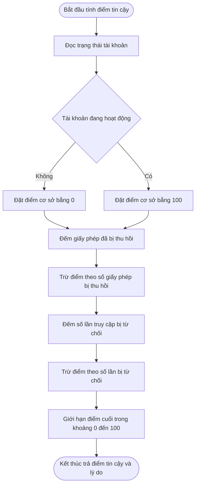
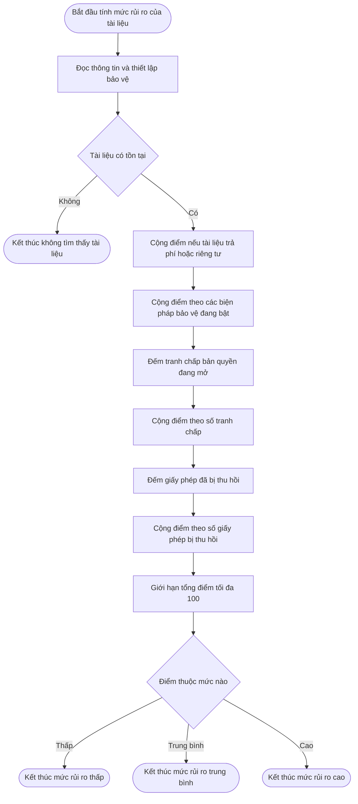
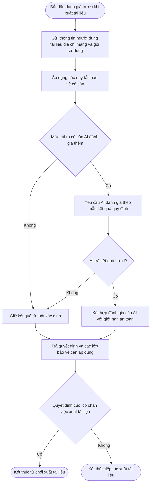

# DRM — kiến trúc và workflow hiện hành

> Tài liệu này bám theo implementation trong `backend/drm`. DRM ưu tiên luật xác
> định, mật mã và audit. Agentic AI chỉ tham gia nhánh đánh giá policy rủi ro cao;
> không được mô tả mọi bước DRM như một tác vụ của agent.

## 1. Phạm vi dịch vụ

DRM chịu trách nhiệm:

- xác thực JWT, session và phân quyền cho API người dùng;
- cấp, kiểm tra, giới hạn thiết bị/lượt mở và thu hồi giấy phép;
- kết xuất EditorJS/LaTeX, đóng thủy ấn hiển thị và thủy ấn ẩn;
- mã hóa tài liệu bằng AES-256-GCM và bọc khóa AES bằng RSA-OAEP SHA-256;
- giữ đúng loại container bảo vệ: `.doclib` cho EditorJS và `.doclibx` cho LaTeX;
- cấu hình bảo vệ theo BASIC, PRO và PREMIUM; ADMIN được chuẩn hóa về khả năng
  PREMIUM nhưng vẫn giữ quyền quản trị riêng;
- giải quyết tranh chấp bản quyền;
- phát hiện bất thường mạng, tính trust score và risk score;
- cấp khóa AES tạm, kiểm tra fingerprint và cung cấp nội dung cho AI nội bộ;
- lưu audit log và metrics vận hành.

Điểm vào chính: [`backend/drm/src/main.py`](backend/drm/src/main.py).

## 2. Kiến trúc tổng thể

Sơ đồ này là bản đồ thành phần và dependency, **không phải workflow nghiệp vụ**.
Node ở đây được phép mang tên service/module; từ mục 3 trở đi, mỗi node workflow
phải là một hành động hoặc một câu hỏi quyết định.

### Ranh giới dữ liệu

| Nơi lưu/nguồn | Dữ liệu |
|---|---|
| MongoDB DRM | `drm_licenses`, `document_drm_settings`, `copyright_disputes`, `audit_logs` |
| Redis | session đã đăng nhập, rate limit, thống kê IP/request 60 giây, khóa AES tạm |
| Content service | tài liệu, quyền đọc/sửa và policy DRM phản chiếu sang content |
| Finance service | giao dịch mua tài liệu premium |
| Humanity service | trạng thái và tier của người dùng |

DRM không trực tiếp phụ thuộc RabbitMQ, MinIO, Qdrant hay Neo4j trong runtime hiện
tại; không đưa các thành phần đó vào workflow DRM.

## 3. Xác thực và phân quyền

- API giấy phép, thủy ấn và cấu hình bản quyền dùng JWT người dùng.
- Toàn bộ `/bao-ve/*` dùng `X-Internal-Token` và chỉ dành cho service-to-service.
- API giải quyết tranh chấp yêu cầu ADMIN.

## 4. Workflow kết xuất tài liệu DRM

Đây là luồng đầy đủ của `GET /thuy-an/{document_id}`.

Khi Agentic AI lỗi, hệ thống không bỏ bảo vệ mà dùng mặc định an toàn: bật
watermark hiển thị, micro-dot và AES.

### Quy ước định dạng

| Định dạng | Nội dung soạn thảo | Khi DRM bật AES |
|---|---|---|
| `.doclib` | EditorJS JSON | Giữ đuôi `.doclib`; payload là container E-DRM đã mã hóa |
| `.doclibx` | LaTeX source | Giữ đuôi `.doclibx`; payload là container E-DRM đã mã hóa |

DRM không chuyển `.doclibx` thành `.doclib`. Hai container dùng chung envelope
`file_id + SHA-256 + nonce + ciphertext`, còn extension bảo toàn engine cần dùng
sau khi giải mã. Khi policy tắt AES, cả hai nhánh kết xuất trả PDF.

## 5. Workflow cấp quyền mở file `.doclib` hoặc `.doclibx`

Endpoint: `POST /giay-phep/kiem-tra`.

`POST /giay-phep/{file_id}/thu-hoi` cho phép chủ giấy phép hoặc ADMIN đặt trạng
thái `REVOKED` và ghi audit log.

## 6. Workflow cấu hình bảo vệ bản quyền

Endpoint: `PUT /ban-quyen/{document_id}`.

Giá trị chung được lưu gồm profile, `AES-256-GCM`, cách giao văn bản, người cập
nhật và thời điểm cập nhật. Token private link chỉ trả một lần; database lưu hash.

## 7. Workflow tranh chấp bản quyền

Implementation hiện tại giải quyết dispute đã tồn tại; tài liệu không được tuyên
bố có workflow tạo/khiếu nại dispute nếu chưa có endpoint tương ứng trong DRM.

## 8. Workflow bảo vệ nội bộ

Các endpoint dưới `/bao-ve` là API service-to-service.

### 8.1 Bất thường mạng

### 8.2 Trust score người dùng

Trust score không được gán cố định theo BASIC/PRO/PREMIUM. Tier chỉ được trả kèm
profile người dùng.

### 8.3 Risk score tài liệu

Risk score cộng các yếu tố đang lưu: premium, private, protection đang bật,
dispute đang mở và số license bị thu hồi. Kết quả được chặn tối đa 100 và phân
loại `LOW`, `MEDIUM`, `HIGH`.

### 8.4 Các API nội bộ khác

| Endpoint | Chức năng |
|---|---|
| `/bao-ve/thuy-an-dong` | Sinh text watermark, token SHA-256, opacity và font |
| `/bao-ve/cap-khoa-aes` | Tạo khóa ngẫu nhiên tạm thời trong Redis với TTL 60–3600 giây |
| `/bao-ve/xac-minh-van-tay` | So fingerprint/IP với lịch sử license và trả risk multiplier |
| `/bao-ve/noi-bo/giay-phep` | Đọc license theo `file_id` |
| `/bao-ve/noi-bo/cau-hinh` | Đọc policy theo `document_id` |
| `/bao-ve/noi-bo/noi-dung-ai` | Kiểm tra quyền Content + `allow_internal_ai`, ghi audit rồi trả nội dung hạn chế |

## 9. Workflow đánh giá policy với Agentic AI

AI không trực tiếp cấp license hoặc giữ khóa. Quyết định cuối vẫn được DRM áp
dụng bằng luật, mật mã và trạng thái lưu trữ.

## 10. Công nghệ đang sử dụng

| Lớp | Công nghệ | Vai trò thực tế |
|---|---|---|
| API | Python 3.11, FastAPI, Uvicorn, Pydantic | HTTP API, validation, dependency injection |
| Xác thực | PyJWT, OAuth2 bearer, HMAC compare | JWT HS256, session và internal token |
| Mật mã | `cryptography`, RSA-OAEP SHA-256, AES-256-GCM, SHA-256 | Bọc khóa, mã hóa file, fingerprint/hash |
| PDF/watermark | PyMuPDF `fitz`, zero-width characters, micro-dot | Đóng watermark hiển thị, ẩn và truy vết |
| Dữ liệu | MongoDB, Motor, PyMongo | License, policy, dispute và audit |
| Trạng thái nhanh | Redis asyncio | Session, rate limit, anomaly window và key TTL |
| Giao tiếp service | HTTPX | Content, Finance, Humanity, Compilation và Agentic AI |
| Quan sát | Loguru, Prometheus middleware, trace ID | Log nghiệp vụ, metrics và correlation |
| Triển khai | Docker Compose, Traefik | Container, health check và route theo prefix |

## 11. API và quyền truy cập

| Prefix | Endpoint chính | Quyền |
|---|---|---|
| `/giay-phep` | kiểm tra, thu hồi | JWT; chủ license hoặc ADMIN tùy thao tác |
| `/thuy-an` | kết xuất, giải mã truy vết | JWT; giải mã truy vết yêu cầu ADMIN |
| `/ban-quyen` | cập nhật policy, giải quyết dispute | Chủ tài liệu; giải quyết yêu cầu ADMIN |
| `/bao-ve` | anomaly, trust, risk, key, fingerprint, internal content | `X-Internal-Token` |
| `/health`, `/ready`, `/metrics` | liveness, dependency readiness, metrics | Vận hành |

## 12. Nguồn kiểm chứng chính

- [Khởi tạo DRM service](backend/drm/src/main.py)
- [API giấy phép](backend/drm/src/api/license.py)
- [API bảo vệ nội bộ](backend/drm/src/api/protection.py)
- [Watermark và E-DRM export](backend/drm/src/services/watermark.py)
- [Cấu hình bản quyền](backend/drm/src/services/copyright.py)
- [Kho giấy phép](backend/drm/src/repositories/license.py)
- [Xác thực và phân quyền](backend/drm/src/core/dependency.py)
- [Danh sách dependency](backend/drm/requirements.txt)

## 13. Quy tắc cập nhật tài liệu

Mỗi khi thêm endpoint DRM, collection, thuật toán mã hóa hoặc dependency service,
phải cập nhật sơ đồ tương ứng, bảng API và bảng công nghệ. Không dùng URI file
tuyệt đối; mọi liên kết phải tương đối từ root repository.
