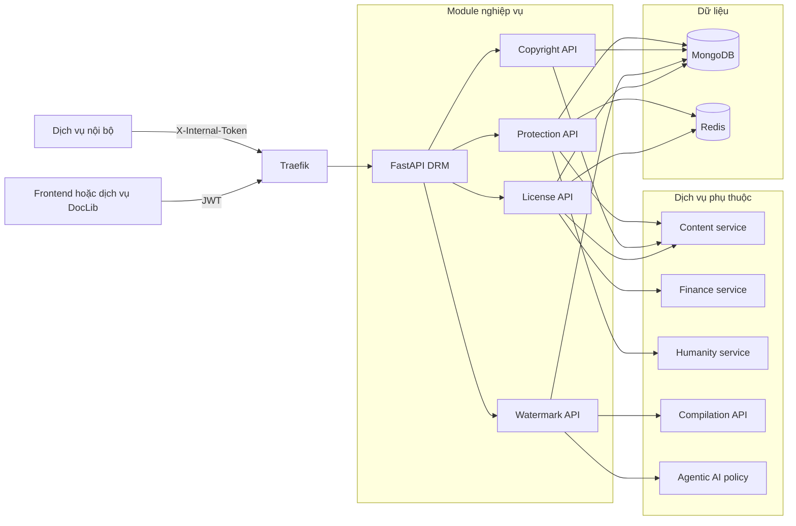
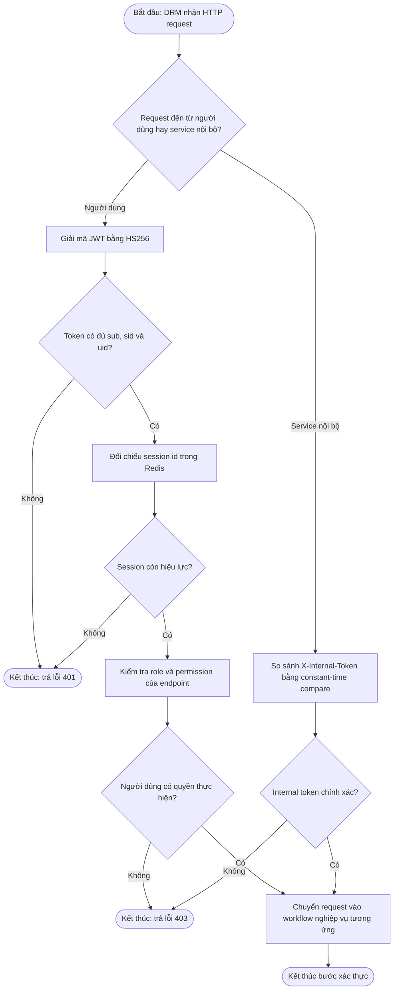
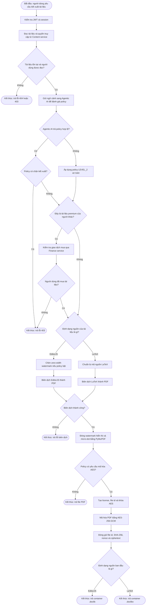
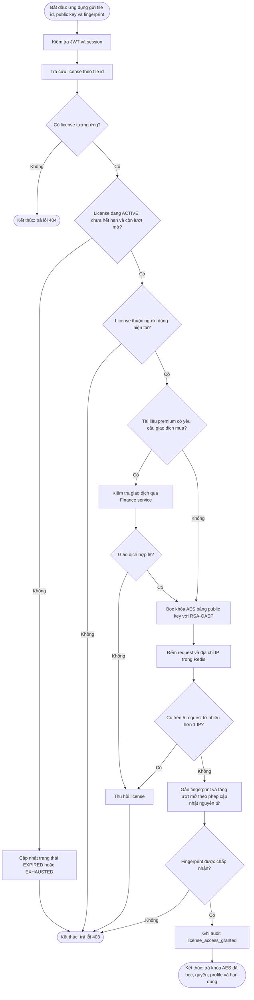
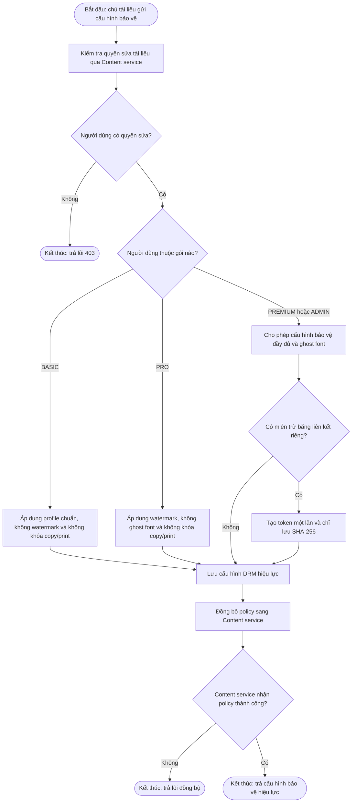
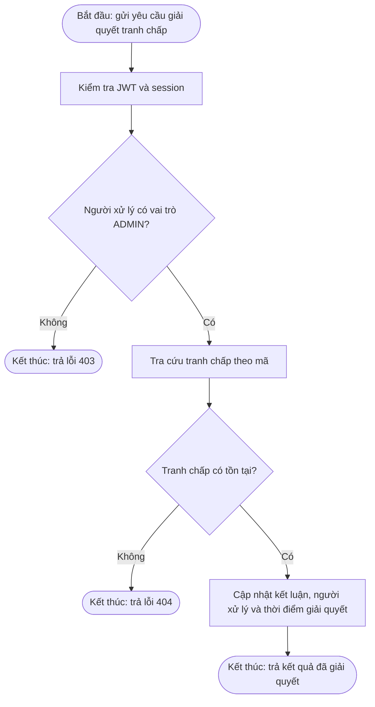
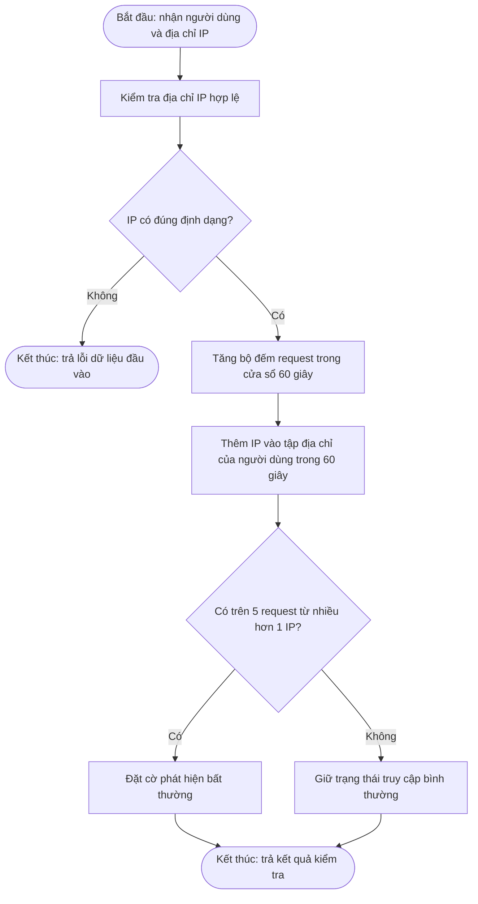
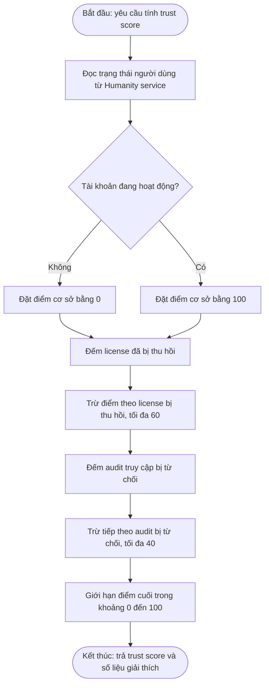
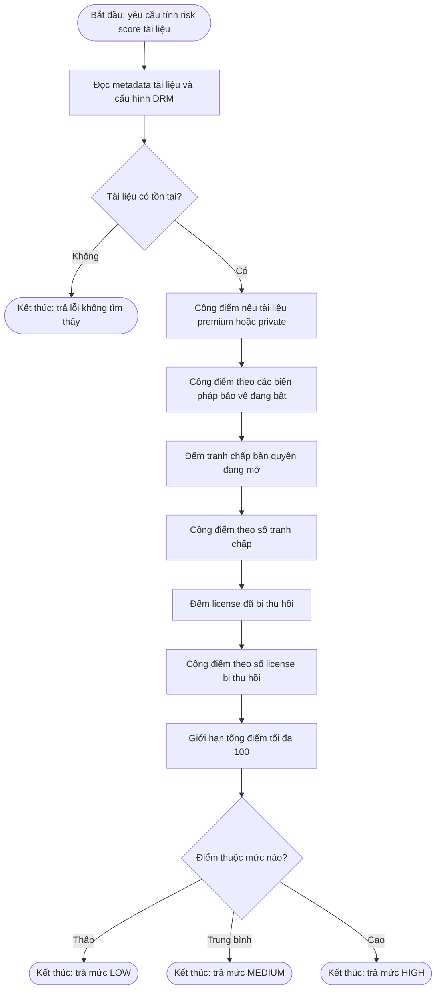
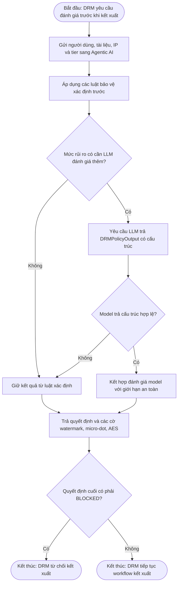

# DRM — kiến trúc và workflow hiện hành

## 1. Kiến trúc tổng thể

## 2. Xác thực và phân quyền

## 3. Workflow kết xuất tài liệu DRM

## 4. Workflow cấp quyền mở file `.doclib` hoặc `.doclibx`

## 5. Workflow cấu hình bảo vệ bản quyền

## 6. Workflow tranh chấp bản quyền

## 7. Workflow bảo vệ nội bộ

### 7.1 Bất thường mạng

### 7.2 Trust score người dùng

### 7.3 Risk score tài liệu

## 8. Workflow đánh giá policy với Agentic AI

## 9. Công nghệ đang sử dụng

| Lớp               | Công nghệ                                              | Vai trò thực tế                                     |
| ------------------ | -------------------------------------------------------- | ------------------------------------------------------ |
| API                | Python 3.11, FastAPI, Uvicorn, Pydantic                  | HTTP API, validation, dependency injection             |
| Xác thực         | PyJWT, OAuth2 bearer, HMAC compare                       | JWT HS256, session và internal token                  |
| Mật mã           | `cryptography`, RSA-OAEP SHA-256, AES-256-GCM, SHA-256 | Bọc khóa, mã hóa file, fingerprint/hash            |
| PDF/watermark      | PyMuPDF`fitz`, zero-width characters, micro-dot        | Đóng watermark hiển thị, ẩn và truy vết         |
| Dữ liệu          | MongoDB, Motor, PyMongo                                  | License, policy, dispute và audit                     |
| Trạng thái nhanh | Redis asyncio                                            | Session, rate limit, anomaly window và key TTL        |
| Giao tiếp service | HTTPX                                                    | Content, Finance, Humanity, Compilation và Agentic AI |
| Quan sát          | Loguru, Prometheus middleware, trace ID                  | Log nghiệp vụ, metrics và correlation               |
| Triển khai        | Docker Compose, Traefik                                  | Container, health check và route theo prefix          |

## 10. API và quyền truy cập

| Prefix                                | Endpoint chính                                          | Quyền                                        |
| ------------------------------------- | -------------------------------------------------------- | --------------------------------------------- |
| `/giay-phep`                        | kiểm tra, thu hồi                                      | JWT; chủ license hoặc ADMIN tùy thao tác  |
| `/thuy-an`                          | kết xuất, giải mã truy vết                          | JWT; giải mã truy vết yêu cầu ADMIN      |
| `/ban-quyen`                        | cập nhật policy, giải quyết dispute                  | Chủ tài liệu; giải quyết yêu cầu ADMIN |
| `/bao-ve`                           | anomaly, trust, risk, key, fingerprint, internal content | `X-Internal-Token`                          |
| `/health`, `/ready`, `/metrics` | liveness, dependency readiness, metrics                  | Vận hành                                    |
